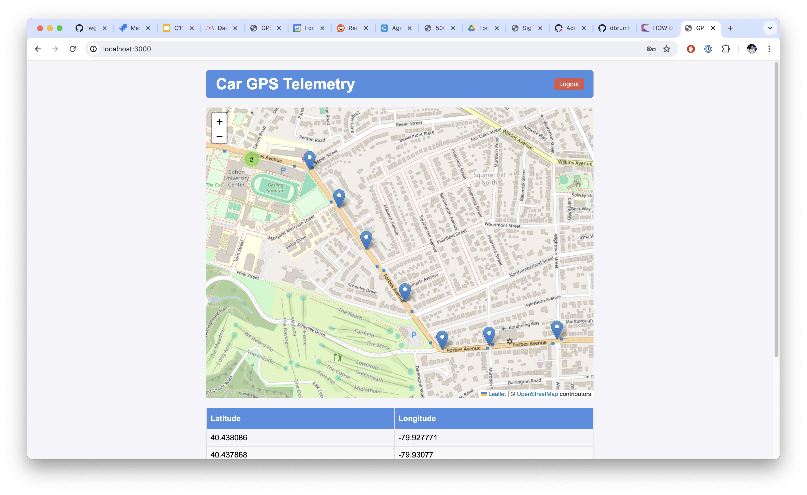

# Automotive GPS Telemetry Service 

Welcome to the Automotive PS Telemetry Service example application.




## What's included

```mermaid
graph TD;
    Car -- API;
    API -- Car;
    API -- Redis;
    API -- UI;
```

- **On Car GPS**: The on-car GPS sensor transmits location data to a cloud API.
  This part tests how well analysis:
    - Identifies vulnerabilities in C code and/or compiled binaries. The code has
      several vulnerabilities introduced, similar to [Damn Vulnerable
      C](https://github.com/hardik05/Damn_Vulnerable_C_Program) and
      [lwgps](https://github.com/MaJerle/lwgps).  
    - Creates testing coverage. Many standards require source and/or binary
      testing coverage. 
    - Identifies what SBOM/SCA components are on the attack surface. There are
      several components that have known vulnerabilities, but are never used at
      runtime thus cannot be attacked.  
- **Cloud API**: The cloud API receives GPS data from cars, and services a UI
  for displaying that information. The API is built on
  [FastAPI](https://fastapi.tiangolo.com/), one of the most popular python
  frameworks today.  This part tests how well analysis: 
    - Identifies vulnerabilities in an API.
    - Identifies API routes that may break. 
    - Identifies what SBOM/SCA components are on the attack surface. Again,
      there are several components that have known vulnerabilities, but not on
      the attack surface. 
- **Database**: We use Redis. We include this as another image that has known
  vulnerabilities, but not on the attack surface. 
- **UI**: A UI that fetches GPS data from the API server, and displays it to an
  authenticated user. This is included for demo purposes only. 

## Getting Started

Make sure you have Docker and Docker Compose installed on your machine. To
bring up, run:
```sh
docker-compose up --build --watch
```


  - (UI)[http://localhost:3000]. The default username and password is
    `me@me.com` and `123456`.  See (./api/app/main.py)[./api/app/main.py].
  - (API)[http://localhost:8000]
  - (OpenAPI Spec)[http://localhost:8000/openapi.json]

**Note** The `--watch` flag requires a recent version of docker-compose, and sync's any
changes in the API or UI files with the running docker instance. If you have an
older version of Docker, you can delete the `develop` section of the
`docker-compose.yml` file and everything should then work. 


## Vulnerabilities

TBD

## Contributing

We welcome contributions. Please fork the repository and submit a pull request with your changes.

## License

This project is licensed under the MIT License. See the (LICENSE.txt)[./LICENSE.txt] file for details.