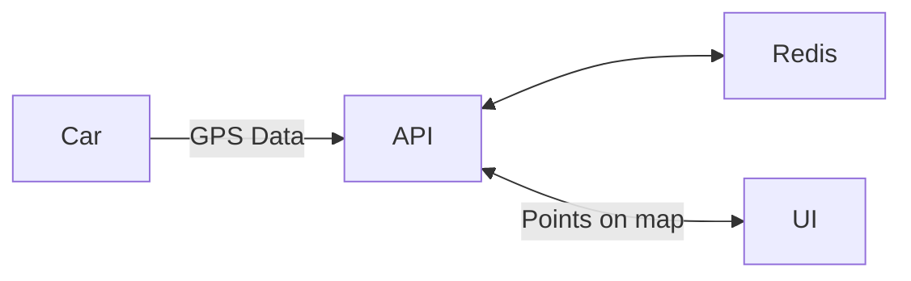

# Mayhem Demo App Service 

Welcome to the Mayhem Demo App!  This demo highlights how Mayhem helps you
solve code, API, and SBOM security and stress testing challenges. The app
contains an on-car GPS service that transmits data to an API, which then is
used by a user UI to display traveled routes. 


## What's included



- **On Car GPS**: This is a native app that transmits GPS sensor data to a
  Cloud API. The source [./car/gps_uploader.c](./car/gps_uploader.c) contains
  vulnerabilities such as:
  * Integer overflow
  * Integer underflow
  * Stack-based buffer overflow
  * Heap overflow
  * Double Free
  * Use-after-free
  * Memory leaks

- **Cloud API**: The cloud API receives GPS data from cars, and services a UI
  for displaying that information. API issues include:
  * SQL Injection at [./api/app/main.py#L81](./api/app/main.py#L81)
  * 
   
- **Database**: We use Redis. We include this as another image that has known
  vulnerabilities, but not on the attack surface. 
- **UI**: A UI that fetches GPS data from the API server, and displays it to an
  authenticated user. This is included for demo purposes only. 

## Getting Started

Make sure you have Docker and Docker Compose installed on your machine. To
bring up, run:
```sh
docker-compose up --build --watch
```

Then navigate to [http://localhost:3000](http://localhost:3000). In more detail: 

  - **UI**: [http://localhost:3000](http://localhost:3000). The default username and password is
    `me@me.com` and `123456`.  See [./api/app/main.py](./api/app/main.py).
  - **API**: [http://localhost:8000](http://localhost:8000). Written in FastAPI (python).
  - **OpenAPI**:
    [http://localhost:8000/openapi.json](http://localhost:8000/openapi.json).
    Generated automatically by FastAPI. 

**Note** The `--watch` flag requires a recent version of docker-compose, and sync's any
changes in the API or UI files with the running docker instance. If you have an
older version of Docker, you can delete the `develop` section of the
`docker-compose.yml` file and everything should then work. 


## Vulnerabilities

You can use [Mayhem](https://mayhem.security) to find the vulnerabilities in
this repo.  


### C Vulnerabilities

[./car/gps_uploader.c](./car/gps_uploader.c) contains vulnerabilities based
upon lwgps and damn vulnerable C, including:
  * Integer overflow
  * Integer underflow
  * Stack-based buffer overflow
  * Heap overflow
  * Double Free
  * Use-after-free
  * Memory leaks

### API Vulnerabilities
[./api/app/main.py](./api/app/main.py) contains a SQL injection vulnerability.

### SBOM non-vulnerabilities
SBOM tools will report various vulnerabilities in the base images that are
unreachable, such as in redis. Since they are unreachable (not on the attack
surface), they do not need to be remediated and are often considered "false
positives" by developers. 


## Contributing

We welcome contributions. Please fork the repository and submit a pull request with your changes.

## License

This project is licensed under the MIT License. See the [LICENSE.txt](./LICENSE.txt) file for details.
