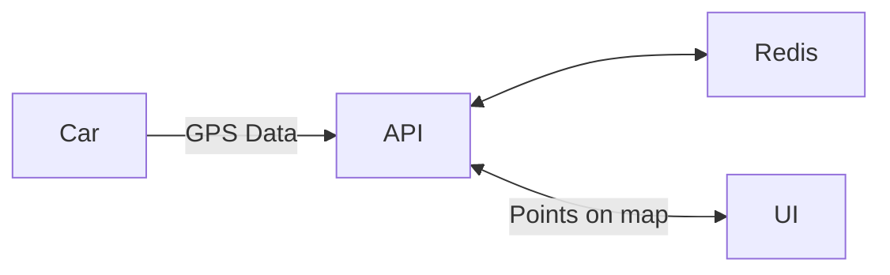

# Mayhem Demo App Service 

Welcome to the Mayhem Demo App!

This demo highlights how Mayhem helps you solve code, API, and SBOM security and stress testing challenges. The app contains:
  * An on-car GPS service (code security, OSS security)
  * Transmits data to an API (API security, OSS security)
  * Stores results in a database (OSS security)
  * Used by a user UI to display traveled routes  


## Structure and Vulnerabilities



- **Code Security**: The GPS code is a native app that transmits GPS sensor
  data to a Cloud API. The source  [./car/gps_uploader.c](./car/gps_uploader.c)
  contains vulnerabilities such as:
  * Integer overflow
  * Integer underflow
  * Stack-based buffer overflow
  * Heap overflow
  * Double Free
  * Use-after-free
  * Memory leaks

- **API Security**: The cloud API receives GPS data from cars, and services a UI
  for displaying that information. The source
  [./api/app/main.py](./api/app/main.py) contains vulnerabilities including: 
  * SQL Injection
  * Path Traversal 
  * Authentication bypass
  * Spec/implementation mismatch.
   
- **SBOM/SCA Security**: There are four images in this repo: redis, car, api,
  and UI. Each is built with OSS components and has vulnerabilities both on and
  off the attack surface.


## Running the App

Make sure you have Docker and Docker Compose installed on your machine and then
run:
```sh
docker compose up --build
```


Then navigate to [http://localhost:3000](http://localhost:3000). In more detail: 

  - **UI**: [http://localhost:3000](http://localhost:3000). The default username and password is
    `me@me.com` and `123456`. Written in Javascript React.
  - **API**: [http://localhost:8000](http://localhost:8000). Written in FastAPI (python).
  - **OpenAPI**:
    [http://localhost:8000/openapi.json](http://localhost:8000/openapi.json).
    Generated automatically by FastAPI. 

**Note** You can add the --watch flag to sync any changes from the UI or API
files to the running docker container. 


**Note 2:** If you've previously run this, please run `docker compose down -v` to
remove any stale volumes. 

## Getting started with Mayhem

### Step 1: Create an account 
Let's unleash some Mayhem! The first thing to do is create a free Mayhem account at
[https://app.mayhem.security](https://app.mayhem.security). 

### Step 2: Install the Mayhem CLI

Now that you have an account, you can start using Mayhem in your local environment.

  * Install the Mayhem CLIs from
    [https://app.mayhem.security/-/installation](https://app.mayhem.security/-/installation)


  * Next, create an API token at
    [https://app.mayhem.security/-/settings/user/api-tokens](https://app.mayhem.security/-/settings/user/api-tokens),
    which is what you’ll use to log in the CLI to the Mayhem server. 

  * Use the token to log in with your token with `mayhem login https://app.
    mayhem.security <your API token>`

  * Mayhem Dynamic SBOM currently has a separate CLI install, and currently
    only supports Linux. Install by following
    [https://app.mayhem.security/docs/dynamic-sbom/installation/](https://app.mayhem.security/docs/dynamic-sbom/installation/).

At the end of this, you will have three CLIs:
  1. `mayhem`, which runs Mayhem for Code analysis
  2. `mapi`, which runs Mayhem for API analysis
  3. `mdsbom`, which runs Mayhem Dynamic SBOM analysis

Note: All CLIs share authentication information, so you need only log in with
one CLI.

### Step 3: Clone and run this repo
Get the code running by:

  * Cloning this repo with `git clone
    https://github.com/forallsecure-CustomerSolutions/mayhem-demo` and change into
    the mayhem-demo directory.  
  * Build and run the docker images with `docker compose up --build`


### Step 4a: Run Mayhem for API
In this step, you’ll run Mayhem for API to check the demo API server. This step
uploads the report to Mayhem for viewing, and also produces a local HTML
report. 

  1. Make sure you have the code running with `docker compose up --build` and
     that you can reach the API on [http://localhost:8000](http://localhost:8000). 

  2. Run `mapi run mayhem-demo/api 1m http://localhost:8000/openapi.json --url
     http://localhost:8000 --html mapi.html --interactive --basic-auth
     "me@me.com:123456" --experimental-rules --ignore-rule
     internal-server-error`

  3. That’s it! You can exit when done.

**Details:**

Mayhem for API requires two things: an API to test, and an OpenAPI spec. In
this example, we scanned the locally running copy of the API, and used the
OpenAPI spec that is automatically generated by the underlying FastAPI
framework. 

The specific arguments you used were:

  * `mayhem-demo/api` is the project name and target name for the app. By
    default, Mayhem puts results in your private workspace. You will see
    results in the Mayhem UI under your personal workspace under this project
    name.  If you want the project in a shared workspace, just prefix the path
    with the workspace name like: `shareworkspace/mayhem-demo/api` 

  * `http://localhost:8000/openapi.json`
    the location of the OpenAPI spec.  FastAPI automatically generates one for
    you, as can most frameworks, or write your specification yourself to check
    your implementation. 

  *  `http://localhost:8000/` is an URL to the running API. The host must be
     reachable from the host running the `mapi` CLI, but need not be internet
     accessible. 

  * `--html mapi.html` says to output a local HTML report called `mapi.html`

  * `--interactive` says to run in interactive mode. Note that you can move
    your cursor through the TUI to dig into results!

  * `--basic-auth` tells `mapi` the credentials for the endpoints using basic
    authentication. `mapi` supports several auth types, and you can find a list
    with `mapi run --help`. 

  * `--ignore-rule internal-server-error` says to ignore internal server errors
   (5xx HTTP response codes).  Some users prefer to see these because they show
   the server has broken code, and some do not. 

**TIP:** `mapi` is a superset and more accurate than ZAP API scanner. But we've
also integrated ZAP support just in case, and even have a docker container with
both `mapi` and `zap`. Try it out with:

```
docker run -it -e MAPI_TOKEN <token> forallsecure/mapi:latest run --url 'https://demo-api.mayhem4api.forallsecure.com/api/v3/'  mayhem-demo/api 60  'https://demo-api.mayhem4api.forallsecure.com/api/v3/openapi.json'   --interactive --zap
```

**Note:**  Make sure you run `docker compose down -v` to remove any old volumes from previous
runs. `mapi` will create new locations each time you run it in redis, and can
quickly create really long responses. 


### Step 4b: Run Mayhem Dynamic SBOM to identify results on the attack surface

Mayhem Dynamic SBOM works by taking in a docker SBOM/SCA report, and outputting
a new SBOM/SCA report based upon attack surface analysis. We’ll be using `docker
scout` to generate the SBOM for this demo, though Mayhem integrates with any
tool that outputs a CycloneDX or SPDX file. 


**Pre-requisites:**
  * Linux system (more OSes coming shortly)
  * The demo service docker images are available and you know their path. They
    do not need to be running. (`docker compose build`).
  * You have installed
    [docker](https://docs.docker.com/engine/install/ubuntu/), are logged into
    docker (`docker login`) and have [docker
    scout](https://docs.docker.com/scout/install/) installed. 
  * You have `mdsbom` installed and you are logged into Mayhem. 


**Steps:**

  1. Run `mdsbom scout ghcr.io/forallsecure-customersolutions/mayhem-demo/api:latest --sca-report-out dsbom-api.sarif`

  2. That’s it! View the results on the Mayhem UI.

**Details:**

The command line about did several things all at once:
1. Built an SBOM and SCA report from `docker scout`
2. Identified the attack surface in the `api` image. 
3. Reduced the SCA findings to only those items on the attack surface. In our
   run, 90\% of the `docker scout` SBOM/SCA results were irrelevant to
   security!
   
In more detail, the arguments: 

  * `scout` specified to run docker scout to get the initial SBOM/SCA result.
    Mayhem supports any SBOM/SCA tool that creates a CycloneDX or SPDX file.
    You can run `mdsbom help` to see other possibilities, like anchore, trivy,
    and more generally any source using a standardized format. 

  * `ghcr.io/forallsecure-customersolutions/mayhem-demo/api:latest` is path to
    the docker image (`docker compose build` will default to this name).

  * ``--sca-report-out dsbom-api.sarif` says to output a SARIF format as file
    `dsbom-api.sarif`.  

Tip: You can use `--workspace <name>` to specify a different workspace to
upload results. 


### Step 4C: Run Mayhem for Code to find code vulnerabilities

**Prerequisites**
You need to have the built docker images from the `docker compose build` step,
and a registry you can push the images to.  You can also use our pre-built
containers [here](https://github.com/orgs/ForAllSecure-CustomerSolutions/packages?repo_name=mayhem-demo).


**Steps:**
 1. Push the docker image to a registry such as Dockerhub or Github Container
    Registry. If you are an enterprise customer, Mayhem comes with a docker
    registry built-in. 
    ```
    docker tag ghcr.io/forallsecure-customersolutions/mayhem-demo/car:latest <docker id>/mayhem-demo/car:latest
    docker push <docker id>/mayhem-demo/car:latest
    ```
   
  2. Start analysis with `mayhem run mayhem-demo/car --image ghcr.io/forallsecure-customersolutions/mayhem-demo/car:latest --duration 1800`

And that’s it! You should be able to see results for Mayhem for Code in your project!

**Details:**
  - `run` tells Mayhem to start a run.
  - `--image ghcr.io/forallsecure-customersolutions/mayhem-demo/` tells
    Mayhem the location of your app's image.
  - `--duration 1800` tells Mayhem to run analysis for up to 30 minutes. (If you
    leave this off, Mayhem will continually pentest your app.)

## Next Steps

Now that you’ve run Mayhem on this app, let's look at how to get you started on
your own apps. Here are some great starting points to bookmark:

  * **Documentation:** We’ve compiled extensive documentation and tutorials online at [https://app.mayhem.security/docs/overview/](https://app.mayhem.security/docs/overview/)

  * **Code Examples:** Mayhem for Code programming language examples at
    [https://github.com/ForAllSecure/mayhem-examples](https://github.com/ForAllSecure/mayhem-examples) 

  * **OSS Examples:** Sometimes examples are the best way to learn, and we’ve
    got you covered.  View over 1500 repositories that have integrated Mayhem
    at
    [https://github.com/orgs/mayhemheroes/repositories](https://github.com/orgs/mayhemheroes/repositories)


## License

This project is licensed under the MIT License. See the [LICENSE.txt](./LICENSE.txt) file for details.
